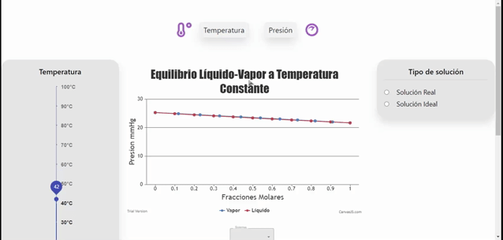
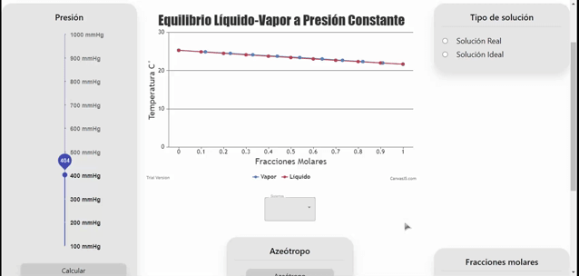
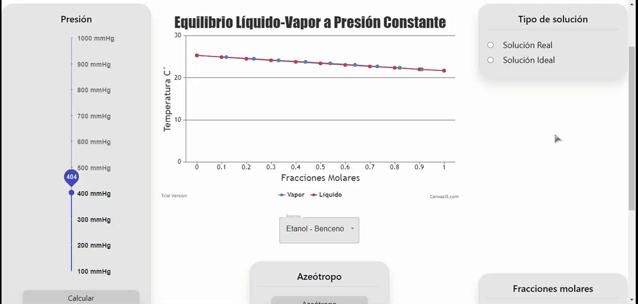
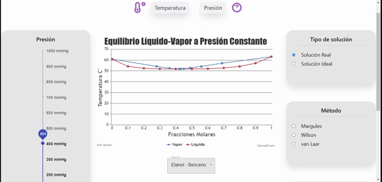
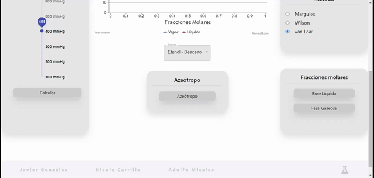
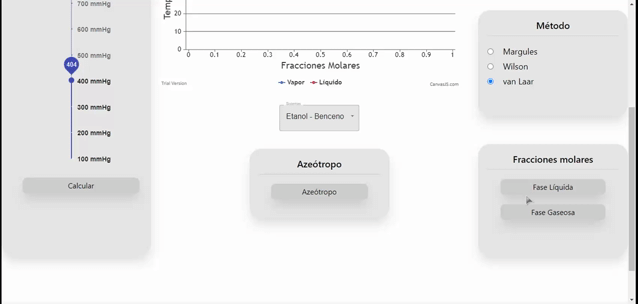

<div id="top"></div>

[![Contributors][contributors-shield]][contributors-url]
[![Forks][forks-shield]][forks-url]
[![Stargazers][stars-shield]][stars-url]
[![Issues][issues-shield]][issues-url]
[![LinkedIn][linkedin-shield]][linkedin-url]

<!-- PROJECT LOGO -->
<br />
<div align="center">
  <a href="https://github.com/JMicalco/AppQuimica_v2">
    
  </a>

<h3 align="center">Chemistry Simulator</h3>

  <p align="center">
    Chemistry Simulator WebApp | JavaScript | React | CSS
    <br />
    <a href="https://github.com/JMicalco/AppQuimica_v2"><strong>Explore the docs »</strong></a>
    <br />
    <br />
    <!-- <a href="https://github.com/JMicalco/AppQuimica_v2">View Demo</a>
    · -->
    <a href="https://github.com/JMicalco/AppQuimica_v2/issues">Report Bug</a>
    ·
    <a href="https://github.com/JMicalco/AppQuimica_v2/issues">Request Feature</a>
  </p>
</div>

<!-- ABOUT THE PROJECT -->

## About The Project

[![Product Name Screen Shot][product-screenshot]]()

Simulator of different entropy equations using graphs and interactions

<p align="right">(<a href="#top">back to top</a>)</p>

### Built With

- [React.js](https://reactjs.org/)

<!-- GETTING STARTED -->

## Getting Started

To get a local copy up and running follow these simple example steps.

### Prerequisites

- [Node.js](https://nodejs.org/es/)

<p align="right">(<a href="#top">back to top</a>)</p>

### Installation

1. Clone the repo
   ```sh
   git clone https://github.com/JMicalco/AppQuimica_v2.git
   ```
2. Install NPM packages
   ```sh
   npm install
   ```

### How to run

```sh
npm start
```

<p align="right">(<a href="#top">back to top</a>)</p>

<!-- USAGE EXAMPLES -->

## Usage

### Select type of equilibrium

1. Click on the top panel either Temperature or Pressure
2. On the left panel move the bar accordingly to the value you want



### Select type of reaction

1. Click on the component on the middle of the web app



### Select type of solution

1. Look for the "Tipo de solucion" Component
2. Click on any of the two available solutions (Real, Ideal)
   > Note: if ideal solution is chosen then the method component will not be available



### Select Method

1. Look for the "Metodo" Component
2. Click on any of the three available methods (Nargules, Wilson, Van Laar)



### Verify if the reaction is an Azeotrope

1. Look for the "Azeótropo" Component
2. Click on the Azeótropo Button



### Get the molar fraction values

1. Look for the "Fracciones molares" Component
2. Click on either "Fase Líquida" or "Fase Gaseosa" Button



<p align="right">(<a href="#top">back to top</a>)</p>

## Contact

- José Adolfo Sánchez Micalco - [@Joseph_Micalco](https://twitter.com/Joseph_Micalco) - jmicalco@gmail.com - [Linkedin][linkedin-url]
- Nicole Carrillo - [@nicky_car](https://twitter.com/nicky_car) - nicole02carrillo@gmail.com - [Linkedin][linkedin-url2]
- Javier Gonzáles - doniagv@gmail.com

Project Link: [https://github.com/JMicalco/AppQuímica_v2](https://github.com/JMicalco/AppQuimica_v2)

<p align="right">(<a href="#top">back to top</a>)</p>

[contributors-shield]: https://img.shields.io/github/contributors/JMicalco/AppQuimica_v2.svg?style=for-the-badge
[contributors-url]: https://github.com/JMicalco/AppQuimica_v2/graphs/contributors
[forks-shield]: https://img.shields.io/github/forks/JMicalco/AppQuimica_v2.svg?style=for-the-badge
[forks-url]: https://github.com/JMicalco/AppQuimica_v2/network/members
[stars-shield]: https://img.shields.io/github/stars/JMicalco/AppQuimica_v2.svg?style=for-the-badge
[stars-url]: https://github.com/JMicalco/AppQuimica_v2/stargazers
[issues-shield]: https://img.shields.io/github/issues/JMicalco/AppQuimica_v2.svg?style=for-the-badge
[issues-url]: https://github.com/JMicalco/AppQuimica_v2/issues
[linkedin-shield]: https://img.shields.io/badge/-LinkedIn-black.svg?style=for-the-badge&logo=linkedin&colorB=555
[linkedin-url]: www.linkedin.com/in/josé-adolfo-sánchez-micalco-b14864140
[linkedin-url2]: https://www.linkedin.com/in/nickycarrillo
[product-screenshot]: Images/SS1.png
